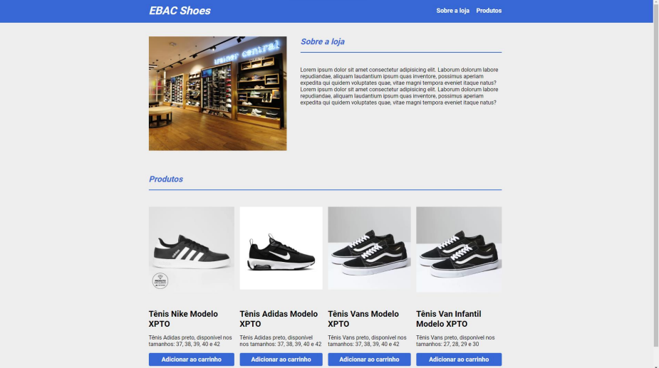
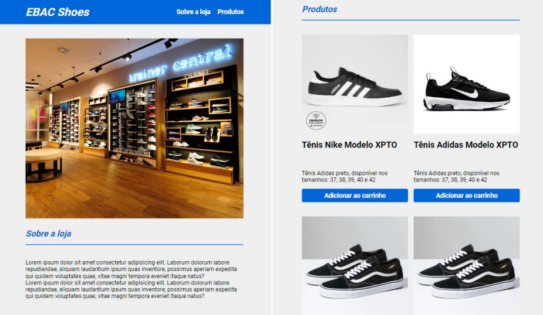
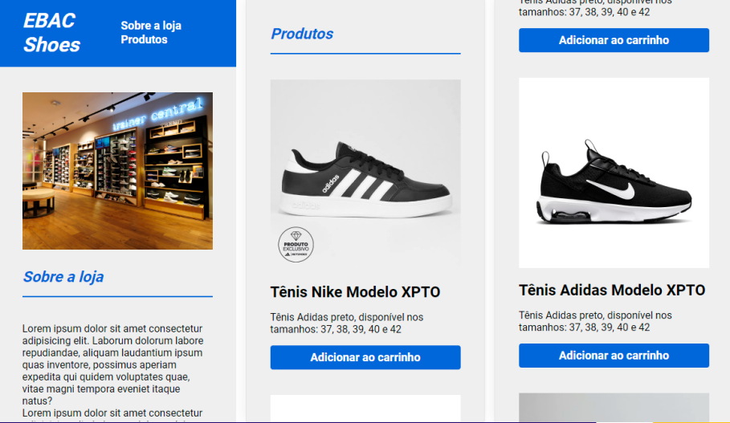
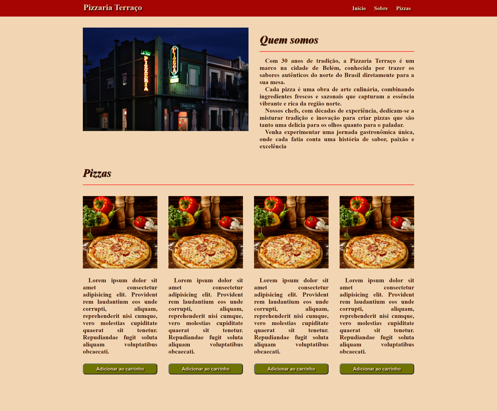
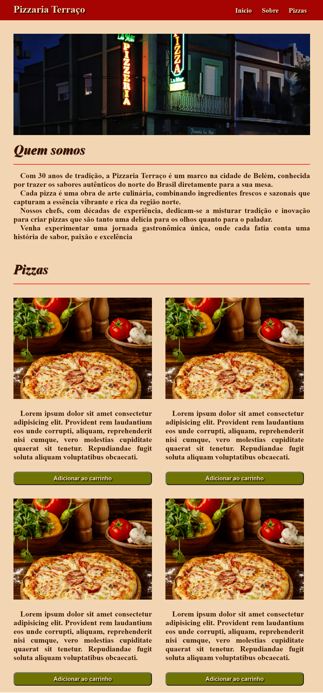
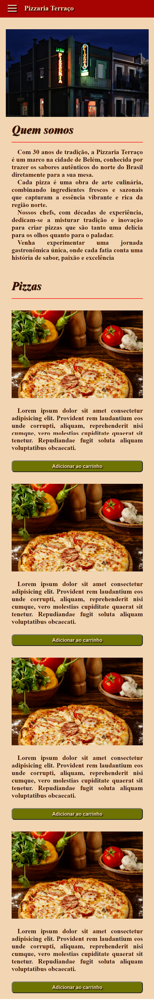

# Resumo

Neste exercício, desenvolvi uma landing de uma pizzaria com um design responsivo, que se adapta a diferentes tamanhos de tela. 

Utilizei apenas as tecnologias web HTML, CSS, e JavaScript para criar o layout e a funcionalidade da página. A loja virtual possui as seguintes seções:

+ Quem somos: Nesta seção, apresento a história e os valores da loja, usando duas colunas com uma imagem e um texto.

+ Pizzas: Nesta seção, mostro quatro sabores de pizza oferececidos, com suas respectivas imagens, nomes, descrições e botões para adicionar ao carrinho.

+ Menu hamburguer: No canto superior esquerdo da página, há um ícone de menu hamburguer, que ao ser clicado, revela um menu lateral com as opções de navegação da pagina (Aparece apenas abaixo de 1024px).

Para publicar o projeto, utilizei a plataforma Vercel, o link do projeto é: [Pizzaria Ebac]()

## Proposta
> A entrega desse exercício consiste em:
>
> • Criar um layout responsivo de uma loja virtual;
>
> • Criar uma seção “sobre a loja”, nesta seção teremos duas colunas uma com a imagem da loja e outra com um texto;
>
> • Criar uma seção de produtos onde haverá uma listagem de 4 produtos, lado a lado, com a imagem, nome e descrição do produto e um botão para adicionar ao carrinho;
>
> • Seguir as adaptações de layout propostas e fazer a publicação na Vercel nos enviando link do projeto. 
> 
> Layout Desktop (a partir de 1024px): 
> 
> Layout Tablet (de 641px até 1023px):
> 
> Layout Mobile (até 640px):
> 

## Resultado

#### a partir de 1024px

#### de 641px até 1023px

#### até 640px

